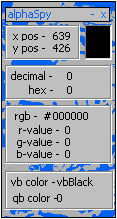



## alphaSpy

### Description

alphaSpy is a fantastic program that finds the color of anything you put your cursor over. if you are browsing a web page or see a program with a color you like, put the mouse pointer over it and it will tell you the colors code in decimal form, hex form, rgb form, vb color form, qbasic color form, the color's r,g, and b value, and many more. view the screen shot to get a better idea of what this program is and to also see the great interface. i would greatly apreciate feedback because i am new to planet source code.
 
### More Info
 

             |
---                |---
**Submitted On**   |2000-03-06 17:25:16
**By**             |[nitrix](https://github.com/Planet-Source-Code/PSCIndex/blob/master/ByAuthor/nitrix.md)
**Level**          |Intermediate
**User Rating**    |3.9 (35 globes from 9 users)
**Compatibility**  |VB 4\.0 \(32\-bit\), VB 5\.0, VB 6\.0
**Category**       |[Complete Applications](https://github.com/Planet-Source-Code/PSCIndex/blob/master/ByCategory/complete-applications__1-27.md)
**World**          |[Visual Basic](https://github.com/Planet-Source-Code/PSCIndex/blob/master/ByWorld/visual-basic.md)
**Archive File**   |[CODE\_UPLOAD3840362000\.zip](https://github.com/Planet-Source-Code/nitrix-alphaspy__1-6460/archive/master.zip)

